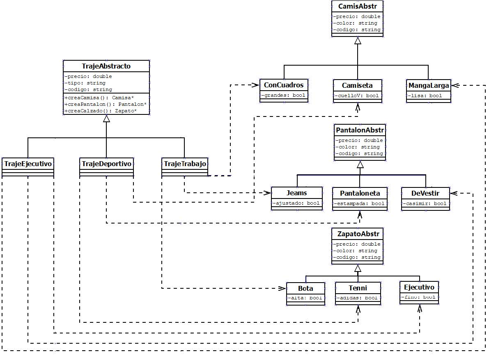
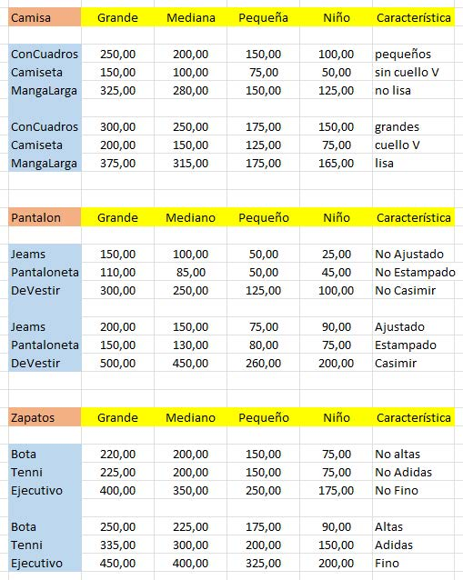
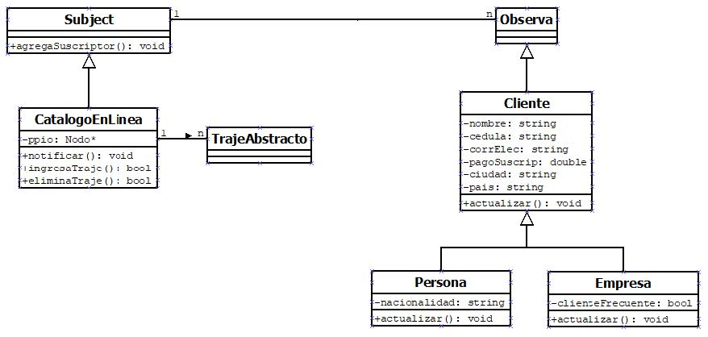
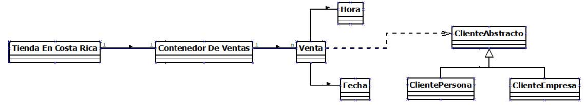

# PROYECTO 2

| UNIVERSIDAD NACIONAL   | ESCUELA DE INFORMÁTICA                          |
| ---------------------- | ----------------------------------------------- |
| EIF 204 PROGRAMACIÓN 2 | EJERCICIO DE CÁTEDRA N° 2                       |
| FECHA DE ENTREGA:      | Hasta el Domingo 19 de Junio 2022               |
| PUNTAJE TOTAL:         | 100 Puntos                                      |
| PORCENTAJE:            | Corresponde a un 15% de la nota final del curso |

## PLANTEAMIENTO DEL PROBLEMA Y OBJETIVOS

El modelo para construir es el de un sistema básico de administración de una tienda de ropa. 

Una gran tienda de ropa de la alta costura para hombre en Costa Rica confecciona tres tipos de trajes, que son: trajes ejecutivos, trajes deportivos y trajes de trabajos, en vista de la situación de la pandemia, la tienda, ha decidido plantear dos maneras de vender sus trajes. El primero es el clásico, es decir, esperar que el cliente llegue a la tienda donde observará los trajes que ahí se disponen para la venta, es decir el cliente selecciona su traje que le gusta, lo(s) compra y se lo(s) lleva. La segunda manera, es que el cliente tenga una conexión web que le permite conectarse y a través de una app, suscribirse y seleccionar desde su casa o trabajo algún traje que le guste observando un catálogo, con su respectivos precios, códigos y tamaños. Nota: el catálogo que observan los clientes en línea es solo lo que hay en la tienda en venta en ese momento (stock). Así, el cliente seleccionará el traje que guste y lo comprará en línea, luego la tienda prepara la logística necesaria para entregarle el traje a la respectiva dirección física del cliente por un precio módico ya establecido para el traslado ver figura siguiente. 

| Código | País       | Ciudad       | Costo Traslado |
| ------ | ---------- | ------------ | -------------- |
| 0001   | EE-UU      | New York     | $100.00        |
| 0002   | Francia    | Paris        | $200.00        |
| 0003   | Italia     | Milán        | $250.00        |
| 0004   | Brasil     | Brasilia     | $150.00        |
| 0005   | Argentina  | Buenos Aires | $175.00        |
| 0006   | Canadá     | Ontario      | $160.00        |
| 0007   | Inglaterra | Londres      | $200.00        |
| 0008   | EE-UU      | California   | $150.00        |

 ➔ Montos mínimos para el traslado por traje al extranjero 

Si la compra se da en línea y el cliente es nacional, su código sería “0009” y su traslado a cualquier lugar del país tiene un costo de 50.00 dólares. Obsérvese que la tienda no envía a todos los lugares en el planeta, solo a los que la lista anterior dispone. 

La cartera de clientes que tiene la tienda presupone dos tipos, primero el cliente físico como persona y el cliente como empresa. Los dos tipos de clientes pueden llegar a la tienda, ya sea en forma directa o virtual (en línea). La tienda vende trajes completos, no vende prendas separadas. Todo traje debe componer una camisa, un pantalón y un par de zapatos. El cliente que llegue a la tienda en línea puede comprar un traje que esta en venta o puede crear sus propios trajes, dependiendo de sus gustos, colores y medidas. Es decir, puede pedir que se le confeccione un traje a la medida que no se observe en el catálogo. El cliente que llega a la tienda **no** puede solicitar que le confeccionen un traje a la medida, esa opción solo es para los clientes en línea. 

Se le ha contratado a usted para que diseñe estos escenarios e implemente una aplicación en el lenguaje C++, que muestre un menú principal que indique, la venta que se desea realizar, si es directa o en línea. La aplicación tendrá la posibilidad de enseñar el catálogo en línea o si el cliente desea crear un traje a la medida. 

El menú principal posiblemente presentará solo cuatro opciones que son: 

1. **Venta directa**, es decir la persona llega a la tienda o establecimiento en forma directa y compra lo que la tienda ofrece en ese momento. 
2. **Venta en línea**. Primero el cliente debe suscribirse, luego se le presenta dos opciones, la venta y traslado de lo que hay en la tienda (stock) o la creación de uno o más trajes a la medida, luego su traslado. 
3. **Mantenimiento**. Aquí el sistema solicita ingresa en otro traje nuevo al stock de la tienda y lo incorpora a la venta, o eliminar uno que se vendió, en los dos casos, se les notifica a todos sus suscriptores. 
4. **Salir**. Salir del sistema. 

> **Nota importante:** Dado que por el momento este software no tiene un control de usuario, resulta que este menú es simbólico, solo nos ayuda a ingresar al área que nos interesa ya sea como empleado(a) de la tienda que utilizaría las opciones (1-3-4) para hacer ventas directas y/o hacer mantenimientos o como comprador en línea utilizando las opciones (3-4). 

Cada traje confeccionado en esta tienda tiene solamente cuatro (4) medidas estándar, que son, para hombre **a- grande, b- mediano, c- pequeño** y **d- niño**. Los precios que manejan todas las prendan es el precio base. Sabiendo que el precio final del traje es la suma de todos los precios base de sus prendas, se entiende que al costo final de cada traje se le debe sumar el 80% de ganancia. Así que eso es algo que deberá tener en cuenta el cliente a la hora de comparar su(s) traje(s). 

A continuación, se presenta un posible diagrama de relaciones de clase obtenido de un patrón que nos ayudará a la parte del software en creación y/o elaboración de trajes a la medida por parte de la tienda. 

### Precios en la tienda

La tienda tiene un listado de precios que varía de acuerdo con el cambio del dólar, pero por el momento los precios los ha mantenido constantes para no sorprender a sus clientes tanto a los nacionales como a los extranjeros. A continuación, se presenta una lista de precios base que tiene la tienda. Observar por ejemplo que, si los Jeans no son ajustados y dependiendo si son grandes, medianos, pequeños o para niños tienen precios diferentes si los Jeans son ajustados y si son grandes, medianos, pequeños o para niños tienen otros precios y así con todas las prendas y calzado que se venden. Los precios base, se reflejan en la siguiente figura. 

### Clientes en línea

Los clientes en línea primero deben suscribirse en la tienda y pagar por su suscripción, que son 200 dólares anuales en caso de personas físicas y 400 dólares anuales en caso de empresas. En el momento de la suscripción, al cliente físico se le solicita la cedula, correo-electrónico, nacionalidad y su nombre completo, para el caso de las empresas, se les solicita el nombre de la empresa y su cedula jurídica, en ambos casos se solicitará también el país y ciudad de ubicación ver siguiente figura. La tienda se compromete a que cada vez que se pone a la venta un traje en la tienda, se le notificará a cada uno de sus suscriptores. 

A continuación, se presenta un posible DRC (diagrama de relaciones de clase) que podría ayudar a la implementación del software en la parte de los clientes en línea y su suscripción. Acordarse de que solo los clientes en línea tienen acceso al catálogo de trajes (stock). 

### Ventas 

La parte más importante del software para la tienda son las ventas y eso se deja ver en el menú inicial. Así que la clase principal debe tener muy en cuenta sus ventas ya sea estas a una persona física o a una empresa. Un posible diagrama para las ventas sería el siguiente. Claro que está incompleto. 

La venta debe realizar no solo el cálculo del traje confeccionado sino además tener que sumar el envío y para eso ya existe una tabla que ayuda con ese otro cobro. 

## REQUERIMIENTOS DE IMPLEMENTACIÓN

1. Es importante que el sistema valide los datos de entrada. No es aceptable que el programa funcione incorrectamente por un error en los datos de entrada. En todo caso, debe informarse al usuario cual es el error y la manera de corregirlo. En ningún momento el sistema deberá permitir la creación de objetos con valores no definidos para los atributos correspondientes. 
2. Se deberán verificar el manejo correcto de las asociaciones entre clases. 
3. Se deberá trabajar de la manera más modular posible, tanto a nivel de clases como a nivel de métodos. 

## ENTREGA Y EVALUACIÓN

**El proyecto debe entregarse en el repositorio de Github asignado en el Aula Virtual. La fecha límite de entrega del proyecto es el domingo **19 de junio antes de la media (½) noche**. No se aceptará ningún proyecto después de esa fecha, ni se admitirá la entrega del proyecto por correo electrónico. El proyecto puede realizarse en grupos.

Se deberá incluir el DRC (Diagrama de Relaciones de Clase) completo del diseño del proyecto, diagramas separados de clase con atributos y los métodos más importantes. 

| Detalle                                                      | Puntaje |
| ------------------------------------------------------------ | :-----: |
| [UML] Diagrama de clases                                     |  5 pts  |
| [PRUEBAS DE UNIDAD] Ingresar clientes, ya sea físicos o en línea. |  5 pts  |
| [PRUEBAS DE UNIDAD] Validación de datos de entrada de clientes. (para que no se repitan). |  5 pts  |
| [PRUEBAS DE UNIDAD] Realizar ventas. (ya sea a clientes nuevos o ya existentes) | 10 pts  |
| [PRUEBAS DE UNIDAD] Cada venta generará una pequeña factura con su despliegue del traje o trajes, costo base, más ganancia del 80%, más 15% del IVA, más el costo de envío | 10 pts  |
| [PRUEBAS DE UNIDAD] Imprimir (resumen) de trajes en stock    |  5 pts  |
| [PRUEBAS DE UNIDAD] Imprimir (resumen) clientes tipo físicos. |  5 pts  |
| [PRUEBAS DE UNIDAD] Imprimir (resumen) clientes tipo empresa. |  5 pts  |
| [PRUEBAS DE UNIDAD] Ventas totales sin ganancia              |  5 pts  |
| [PRUEBAS DE UNIDAD] Ventas totales con ganancia              |  5 pts  |
| [PRUEBAS DE UNIDAD] Ganancia neta de la tienda. (Usar puntos 8-9) |  5 pts  |
| [PRUEBAS DE UNIDAD] Imprimir el código del traje más vendido, e imprimir ese traje |  5 pts  |
| [ARCHIVOS] Guardar toda la información en archivo(s) y recuperarla después | 10 pts  |
| [PATRONES DE DISEÑO] Implementación correcta de los patrones de diseño | 20 pts  |

### Notas

- No se permite el plagio o copia de este proyecto. Encaso de copia o plagio de alguna parte o de la totalidad del mismo será notificado a las instancias superiores de la Escuela de Informática para su respectivo proceso.
- El proyecto presupone que en cualquier momento que usted necesite más información al respecto de un tema, usted debe realizar su propia investigación y estudio de cualquier tema adicional para cumplir y completar con los requerimientos aquí planteados.  
